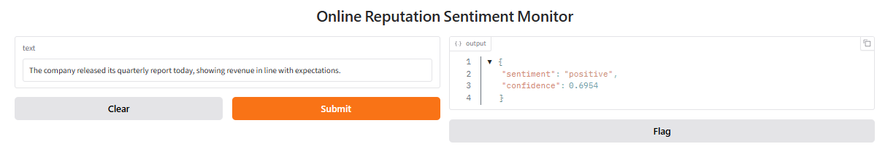
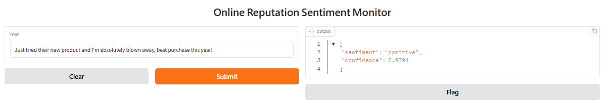
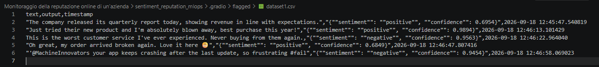

# Sentiment Reputation Monitor

Demo del modello [`cardiffnlp/twitter-roberta-base-sentiment-latest`](https://huggingface.co/cardiffnlp/twitter-roberta-base-sentiment-latest) per la classificazione del sentiment (`negative`/`neutral`/`positive`) di testi social, nell'ambito del progetto "Monitoraggio della reputazione online di un'azienda".

Questo Space viene pubblicato automaticamente dal job `deploy` della pipeline CI/CD (`.github/workflows/ci.yml` nella radice del repository GitHub), dopo che i test in `tests/test_app.py` sono passati — non va aggiornato a mano.

---

## Come replicare e usare questo progetto

Il codice vive dentro un monorepo con tutti i progetti d'esame ([`giuli-c/Folder-progetti-ProfessionAI`](https://github.com/giuli-c/Folder-progetti-ProfessionAI)), in questa cartella (`Monitoraggio della reputazione online di un'azienda/sentiment_reputation_mlops/`).
I quattro workflow GitHub Actions (`ci.yml`, `train.yml`, `train-reviewed.yml`, `monitor.yml`) vivono invece alla **radice** del repository (`.github/workflows/`), ma sono limitati a questa cartella tramite `paths:` e `working-directory:` — se sposti/copi solo questa cartella altrove, dovrai portarti dietro anche quei quattro file e aggiustare i percorsi al loro interno.

### 1. Setup locale

```bash
git clone https://github.com/giuli-c/Folder-progetti-ProfessionAI.git
cd "Folder-progetti-ProfessionAI/Monitoraggio della reputazione online di un’azienda/sentiment_reputation_mlops"
```

**Ambiente virtuale** (consigliato: evita di installare le dipendenze di questo progetto nell'ambiente Python globale, dove potrebbero scontrarsi con quelle degli altri progetti d'esame). Va creato **una sola volta**.

Su **Windows**, crealo in un percorso **corto, fuori da questa cartella** (non `.\venv`): il percorso completo di questo progetto è già lungo di suo, e i file interni di `torch`/`transformers` sono annidati molto in profondità (es. `transformers\models\audio_spectrogram_transformer\configuration_audio_spectrogram_transformer.py`) — sommati superano facilmente il limite storico di Windows sui percorsi (260 caratteri, `MAX_PATH`), e l'installazione (o anche solo l'avvio di `app.py` in un secondo momento) fallisce con `FileNotFoundError`/`No such file or directory` su file che in realtà esistono. Un venv fuori da questa cartella, con un nome corto, evita il problema alla radice:

```powershell
python -m venv C:\venvs\sentiment-reputation-monitor
```

Poi va **attivato**:

```powershell
C:\venvs\sentiment-reputation-monitor\Scripts\Activate.ps1
```

Se PowerShell rifiuta di eseguire lo script di attivazione ("l'esecuzione di script è disabilitata su questo sistema"):

```powershell
Set-ExecutionPolicy -Scope CurrentUser -ExecutionPolicy RemoteSigned
```

(poi ripetere l'attivazione). Infine, con il venv attivo (prompt con `(sentiment-reputation-monitor)` o `(venv)` davanti):

```powershell
python -m pip install --upgrade pip
pip install -r requirements.txt
```

Se `pip install -r requirements.txt` da solo dà "pip non riconosciuto", usare `python -m pip install -r requirements.txt` — più affidabile su Windows perché non dipende dal PATH di `pip` separatamente da quello di `python`.

**Alternativa, se si preferisce comunque un venv dentro la cartella del progetto** su Windows: abilitare il supporto ai percorsi lunghi a livello di sistema (fix permanente, utile anche per gli altri progetti in questa stessa cartella). PowerShell **come Amministratore**, poi **riavviare il PC**:
```powershell
New-ItemProperty -Path "HKLM:\SYSTEM\CurrentControlSet\Control\FileSystem" -Name "LongPathsEnabled" -Value 1 -PropertyType DWORD -Force
```

### 2. Provare il modello in locale

```bash
python app.py
```

Apre una pagina Gradio locale dove scrivere un testo e vedere subito `sentiment`/`confidence` — usa `predictor.SentimentPredictor`, lo stesso modulo condiviso da tutto il resto del progetto (vedi `config.MODEL_NAME`).

Qualche frase da provare, per vedere il modello su casi diversi (il modello lavora solo in inglese):

- **Negativo chiaro**: `This is the worst customer service I've ever experienced. Never buying from them again.`
- **Positivo chiaro**: `Just tried their new product and I'm absolutely blown away, best purchase this year!`
- **Neutro**: `The company released its quarterly report today, showing revenue in line with expectations.`
- **Ambiguo/ironico**: `Oh great, my order arrived broken again. Love it here 🙃`
- **Con menzione/hashtag, stile social**: `@MachineInnovators your app keeps crashing after the last update, so frustrating #fail`

Gli ultimi due sono i più interessanti: guarda il valore di `confidence` restituito insieme a `sentiment`, non solo l'etichetta — è lì che si vede se il modello è davvero sicuro o sta arrancando su un caso ambiguo.

**Screenshot della demo**, con due esempi reali provati sull'interfaccia:

| Esempio "Neutro" → classificato `positive` (confidence 0,6954) | Esempio "Positivo chiaro" → classificato correttamente `positive` (confidence 0,9894) |
|---|---|
|  |  |

Il primo caso è proprio l'esempio del limite descritto sulla classe `neutral`, documentata come la classe più difficile per questo modello; il secondo mostra invece un caso non ambiguo, con confidence molto più alta (0,99).

**Il pulsante "Flag" sotto l'output**: è il comportamento di default di `gr.Interface` (non è stato configurato in `app.py`), non una funzionalità di questo progetto. Se cliccato, salva input e output correnti in un CSV locale (`.gradio/flagged/dataset1.csv`, nella cartella di lavoro), ma non è collegato a `monitoring/history.json` né al dataset di retraining di `train.py` — non è una vera implementazione di una coda di revisione umana (human-in-the-loop), solo un log locale non usato dal resto della pipeline.



Da notare, tra gli esempi flaggati: anche la frase ironica *"Oh great, my order arrived broken again. Love it here 🙃"* è stata classificata come `positive` (confidence 0,6849) — un altro caso reale, oltre a quello neutro, in cui il modello prende il tono superficialmente positivo delle parole ("great", "love") senza cogliere il sarcasmo. Un ulteriore promemoria pratico della difficoltà del modello con linguaggio non letterale (ironia, sarcasmo).

### 3. Eseguire i test

`pytest` non è in `requirements.txt` (di proposito: serve solo per sviluppare/testare, non per far girare l'app in produzione — anche la CI lo installa a parte). Va installato una volta nel venv:

```bash
pip install pytest
pytest -q
```

Esegue i tre file di test: `test_app.py` per modello e Gradio, `test_data.py` per raccolta e revisione, `test_training.py` per retraining e automazione. `conftest.py` (vuoto) è necessario perché pytest trovi `predictor.py` dalla cartella `tests/` — non rimuoverlo.

### 4. Cosa succede automaticamente (CI)

Ad ogni **push o pull request su `main`** che tocca qualcosa dentro questa cartella, `.github/workflows/ci.yml` fa partire due job in sequenza:

1. **`test`**: installa le dipendenze ed esegue `pytest`.
2. **`deploy`** (solo su push diretto a `main`, mai sulle PR): se i test sono passati, esegue `deploy_to_hf.py`, che pubblica `app.py`, `predictor.py`, `requirements.txt` e questo stesso `README.md` come HuggingFace Space (`config.SPACE_REPO_ID`) — creandolo al primo deploy se non esiste ancora.

Non serve fare nulla a mano: basta pushare su `main`.

### 5. Lanciare un retraining (manuale)

Da GitHub → tab **Actions** → workflow **"Train - Monitoraggio reputazione online"** → **Run workflow**, impostando (opzionali, hanno un default — quello **vincente** trovato dopo uno sweep di prove, si veda `SCELTE_PROGETTUALI_ESAME.md`):
- `data_source`: reviewed (dataset interno approvato, default) oppure external (vecchio esperimento);
- `n_train`: numero totale di esempi (default **132**, inclusa la quota replay, esclusa la validation);
- `n_replay`: quota del totale dal train TweetEval (default **66**: replay 1:1, non 2:1);
- `epochs`: massimo di epoche (default **10**, con early stopping);
- `learning_rate`: learning rate della testa (default **0.000002**);
- `patience`: epoche senza miglioramenti ammissibili prima dello stop (default **10**);
- `n_eval`/`n_val`: esempi di test/validation per dataset (default **500** ciascuno — con soli 200, il calo di F1 misurato su validation e sul test finale può differire abbastanza da cambiare l'esito vicino alla soglia di tolleranza);
- `publish`: se `false`, aggiunge `--no-push` (utile per testare senza pubblicare).

Il training usa il replay: mescola fino a 1000 testi interni approvati e 500 originali per provare a contenere il peggioramento sul dominio precedente senza aumentare il totale. Le due quote restano bilanciate per classe; vengono esclusi duplicati e testi di validation/test. `--n-replay 0` disattiva il replay. Non e' garantito un miglioramento.

Il backbone RoBERTa resta congelato. A ogni epoca lo script valuta due validation separate: 200 testi riservati dal train del dataset nuovo (dopo la rimozione dei testi duplicati) e 200 dallo split validation di TweetEval. Conserva in RAM solo i pesi della testa migliore: la F1 nuova deve migliorare di oltre 0.001 rispetto al miglior valore ammissibile, inizialmente quello del modello di partenza, e il calo di F1 sulla validation originale deve restare entro 0.02. Dopo 2 epoche senza miglioramenti ammissibili si ferma e ripristina la testa selezionata. Se nessuna epoca soddisfa i criteri, mostra comunque il confronto sui test dell'ultima epoca a scopo diagnostico, con un avviso rosso, e rifiuta il retraining. Questo confronto non modifica la decisione presa sulla validation e non autorizza la pubblicazione.

Prova locale senza pubblicazione (stessa configurazione nella sezione 9-bis del notebook Colab):

```bash
python train.py --data-source reviewed --n-train 1500 --n-replay 500 --epochs 3 --learning-rate 1e-6 --n-val 200 --patience 2 --no-push
```

Il numero di epoche è un tetto, non una durata garantita. Più dati richiedono più lavoro per epoca anche con backbone congelato. Per regolare gli iperparametri usare la validation, non i due test finali. `--no-push` non salva permanentemente il candidato: il checkpoint della testa viene usato solo durante il processo.

Con `--data-source external`, `train.py` riaddestra il modello su `mteb/tweet_sentiment_extraction` (dati mai visti dal modello base, diverso da TweetEval — vedi il docstring in cima al file per il perché), confronta le metriche prima/dopo su **due** test set (quello nuovo + un campione di `tweet_eval` come controllo di regressione), e pubblica il modello candidato su `config.RETRAINED_MODEL_REPO_ID` **solo se** il calo di F1 macro sul benchmark originale resta entro `REGRESSION_TOLERANCE` — altrimenti il job fallisce esplicitamente e non pubblica nulla.

Le esecuzioni successive di `train.py` ripartono automaticamente dall'ultimo modello già pubblicato su `RETRAINED_MODEL_REPO_ID`, se esiste (vedi `resolve_base_model()` in `train.py`) — i retraining si incatenano.

**Promuovere il modello candidato in produzione è una decisione manuale separata**: aggiornare `MODEL_NAME` in `config.py` con il valore di `RETRAINED_MODEL_REPO_ID`. Solo dopo questo edit (commit + push) `predictor.py`
— e quindi `app.py`/`monitor.py`/i test — inizieranno a usare il modello nuovo. Nessun trigger automatico lo fa da solo.

### 6. Monitoraggio continuo (schedulato)

`.github/workflows/monitor.yml` parte **solo a mano** per ora, dalla tab Actions (`workflow_dispatch`) — il cron giornaliero (`0 8 * * *` UTC) è presente nel file ma commentato; basta togliere il commento per farlo
scattare da solo ogni giorno. Ogni esecuzione di `monitor.py`:

1. scarica testi pubblici reali dalla timeline federata di un'istanza Mastodon (`config.MASTODON_INSTANCE`, di default `mstdn.social`) — non serve nessun token, l'accesso è anonimo. **Nota**: alcune istanze grandi (es. `mastodon.social`, `mastodon.online`) hanno disattivato l'accesso anonimo a questo endpoint (risposta `422 "This method requires an authenticated user"`); se `MASTODON_INSTANCE` smettesse a sua volta di funzionare, basta sostituirla con un'altra istanza generalista che permetta ancora l'accesso anonimo (es. `fosstodon.org`, `mastodon.world`, `hachyderm.io`);
2. li classifica con il modello attuale (`predictor.SentimentPredictor`);
3. calcola la quota di sentiment negativo del batch e la confronta con la baseline delle esecuzioni precedenti (baseline calcolata solo sulle esecuzioni passate, mai includendo quella corrente — vedi il commento nel codice di `monitor.py`);
4. se supera la soglia statistica o quella di business (`MAX_NEGATIVE_SHARE_INCREASE`), stampa un warning visibile nella pagina del job GitHub Actions;
5. salva il risultato in `monitoring/history.json` e lo ricommitta nel repository — senza questo passaggio ogni esecuzione ripartirebbe da zero, senza nessuna storia su cui costruire una baseline.

**Provarlo in locale** (con il venv attivo, da dentro `sentiment_reputation_mlops/`):

```bash
python monitor.py
```

Alla **prima** esecuzione (storia vuota), l'output è simile a questo:

```
Quota di sentiment negativo in questo batch: 12.00%
Storia insufficiente per calcolare una baseline (servono almeno 2 esecuzioni precedenti, disponibili 0).

Storia aggiornata: 1 esecuzioni salvate in ...\sentiment_reputation_mlops\monitoring\history.json.
```

**Cosa significa**: non è un errore. `MIN_HISTORY_FOR_BASELINE` (`config.py`) è impostato a 2 — servono almeno 2 esecuzioni *precedenti* prima che `monitor.py` abbia abbastanza storia per calcolare una media e una deviazione standard affidabili su cui basare la soglia di alert (si veda il punto 3 sopra: la baseline non include mai l'esecuzione corrente, per non essere circolare). Alla prima esecuzione la storia è vuota, quindi il controllo di alert viene saltato del tutto e il risultato (12% in questo esempio) viene solo salvato come primo record in `monitoring/history.json`.

Alla **seconda** esecuzione, la storia ha ormai 1 record precedente (ancora sotto la soglia di 2), quindi il controllo di alert viene di nuovo saltato — ma il batch di questa run è diverso dal primo (la timeline pubblica cambia in continuazione, si veda sopra), qui il 25%:

```
Quota di sentiment negativo in questo batch: 25.00%
Storia insufficiente per calcolare una baseline (servono almeno 2 esecuzioni precedenti, disponibili 1).

Storia aggiornata: 2 esecuzioni salvate in ...\sentiment_reputation_mlops\monitoring\history.json.
```

Rilanciando `python monitor.py` una terza volta, `history.json` ha finalmente 2 record precedenti (12% e 25%) e compare anche il calcolo della baseline:

```
Quota di sentiment negativo in questo batch: 3.85%
Baseline storica (2 esecuzioni precedenti): media 18.50%, soglia statistica 25.00%
Alert statistico: False
Alert di business (incremento > 15%): False

Storia aggiornata: 3 esecuzioni salvate in ...\sentiment_reputation_mlops\monitoring\history.json.
```

In produzione questo accumulo avviene da solo nel tempo grazie alle esecuzioni schedulate di `monitor.yml`, che ricommittano `history.json` ad ogni run.

**Come appare un alert scattato (dimostrazione sintetica, non dati reali)**: con un campione di post pubblici generico, una quota di sentiment negativo abbastanza alta da superare la baseline (qui: 25%/33,5%) è un evento raro — rincorrerlo aspettando dati reali non è pratico. Per documentare anche questo caso, `history.json` è stato temporaneamente sovrascritto con 2 record fittizi a bassissima quota negativa (1%) e `MAX_NEGATIVE_SHARE_INCREASE` abbassato temporaneamente a 0,02 in `config.py`, poi ripristinati entrambi subito dopo. Con questi valori, un normale batch scaricato dal vivo da Mastodon ha fatto scattare entrambi gli alert:

```
Quota di sentiment negativo in questo batch: 18.18%
Baseline storica (2 esecuzioni precedenti): media 1.00%, soglia statistica 1.00%
Alert statistico: True
Alert di business (incremento > 2%): True
::warning::Possibile picco di sentiment negativo rilevato nel monitoraggio continuo.
```

L'annotazione `::warning::` è quella che GitHub Actions mostra in giallo nella pagina del job quando questo scatta nel workflow schedulato (`monitor.yml`), oltre che nel log testuale.

### 7. Secret richiesti

Da impostare in GitHub → Settings del repository → **Secrets and variables → Actions**:

| Secret | Serve a | Usato da |
|---|---|---|
| `HF_TOKEN` | Token HuggingFace con permessi di **scrittura** sia su Space sia su repository modello (serve un token "Write", non "Read") | job `deploy` di `ci.yml` (pubblica lo Space); `train.yml` (pubblica il modello candidato) |

`monitor.yml` non richiede nessun secret HuggingFace (l'accesso alla timeline pubblica di Mastodon è anonimo); usa invece il `GITHUB_TOKEN` automatico di Actions (già disponibile, non va creato) per ricommittare `monitoring/history.json` — per questo il workflow dichiara `permissions: contents: write`.

### 8. Configurazione centralizzata

Tutte le costanti sopra (`MODEL_NAME`, `RETRAIN_DATASET`,`RETRAINED_MODEL_REPO_ID`, `REGRESSION_TOLERANCE`, `MASTODON_INSTANCE`, `MAX_NEGATIVE_SHARE_INCREASE`, `SPACE_REPO_ID`, ecc.) vivono in un solo punto: `config.py`. Per cambiare modello, dataset di retraining, istanza Mastodon o una qualunque soglia, si modifica solo lì.


## Revisione umana dei post Mastodon

Il monitoraggio alimenta `monitoring/review_queue.json`: confidence <= 0.75
oppure un campione deterministico del 10% dei post piu' sicuri. Sono ammessi solo
post esplicitamente marcati come inglesi; boost esclusi. La coda deduplica per ID
e testo e non modifica decisioni umane gia' salvate.

In `config.py`, impostare `MONITOR_KEYWORDS` con i nomi reali dell'azienda/prodotti.
La lista vuota indica un campione generale di Mastodon, non una misura della
reputazione aziendale. Il filtro opera sulla timeline letta (massimo 40 post per
richiesta), non effettua una ricerca globale. Le baseline storiche sono separate
per ambito. Il cron del monitor resta disattivato come nella configurazione esistente.

Dalla cartella `sentiment_reputation_mlops`, eseguire `python monitor.py`.
Aprire poi `monitoring/review_queue.json` con un editor di testo e revisionare
manualmente ogni post, conservando il testo originale e l'etichetta proposta.
Il formato attualmente usato da monitoraggio, training e notebook resta JSON.

Per approvare un post, compilare questi campi nella sua voce esistente
(esempio dei soli campi da modificare, non sostituisce la voce completa):

```json
{
  "validated_label": "neutral",
  "review_status": "approved",
  "reviewer": "Giulia",
  "reviewed_at": "2026-09-19T14:00:00+02:00"
}
```

Usare la propria etichetta (`negative`, `neutral` o `positive`) e la data/ora
reale della revisione. Lasciare `review_is_simulated` a `false` per revisioni reali.
Per escludere un testo ambiguo o non pertinente, impostare `review_status` a
`excluded` e `validated_label` a `null`; compilare anche revisore e data.
I post ancora da leggere restano `pending`. Non modificare ID, testo, split
o predizione originale. Salvare mantenendo la sintassi JSON valida.

**Scorciatoia**: per non scrivere a mano `review_status`/`reviewer`/`reviewed_at`
su ogni riga, basta compilare solo `validated_label` sulle righe `pending` da
approvare, poi lanciare `python approve_reviewed.py` (opzionale `--reviewer
"Nome"`, default "Giulia"): completa da solo i tre campi di corredo per tutte
le righe con `validated_label` ormai scritto, senza mai decidere un'etichetta
al posto della persona (le righe ancora vuote restano `pending`, intatte).

L'etichetta del modello e' solo un suggerimento: nessuna approvazione e'
simulata o automatica. Per correggere una revisione, aggiornare l'etichetta
umana e la data. Gli split vengono assegnati alla raccolta con hash stabile
del testo (circa 60% train, 20% validation, 20% test) e restano invariati.
`review_data.py` controlla i dati approvati quando vengono caricati dal training.
Per verificare la disponibilita' senza avviare il training:

```powershell
python human_retrain.py --check
```

Il workflow del monitor conserva la coda nel repository insieme alla storia:
in un repository pubblico, i testi raccolti e i dati di revisione sono pubblici.
Vengono salvati ID/URL del post, testo, modello, confidence e decisione di revisione,
senza copiare il profilo dell'autore.

### Training automatico dopo l'approvazione

Fare commit e push su main delle revisioni in `monitoring/review_queue.json`.
Il nuovo workflow **Train - Etichette approvate** verifica prima, senza caricare
modelli, di avere almeno **20 train, 5 validation e 5 test per ciascuna classe**.
Sono soglie dimostrative minime: campioni cosi' piccoli non danno stime robuste.
Se mancano dati, li si accumula nelle raccolte successive.

Il workflow usa solo `validated_label` degli esempi approvati, mai la label
predetta. La quota nuova e' adattata alla classe meno rappresentata, fino a
1000 testi nuovi, con replay TweetEval pari a circa meta' della quota nuova.
Si mantengono backbone congelato, massimo 3 epoche, learning rate 1e-6,
early stopping, confronto diagnostico anche in caso di rifiuto e gate finali.
`HF_TOKEN` serve per pubblicare il candidato solo se accettato; la promozione
a modello in produzione resta manuale. Il modello non viene pubblicato se rifiutato.

Il fingerprint degli esempi approvati evita di ripetere il training quando cambia
solo la coda pending o quando il dataset e' gia' stato elaborato. Il tentativo,
anche rifiutato, viene registrato in `monitoring/retraining_state.json`;
un errore tecnico puo' essere ritentato esplicitamente.

Prova locale senza pubblicazione:

```powershell
python human_retrain.py --check
python human_retrain.py
# Solo per ripetere consapevolmente un tentativo sullo stesso dataset:
python human_retrain.py --force
```

Il report viene conservato come artifact di Actions, anche se il candidato e'
rifiutato. Il workflow dimostrativo sul dataset esterno rimane disponibile
separatamente. Le revisioni umane sono ancora necessarie: finche' la coda e'
vuota o insufficiente non viene avviato un training interno.


### Fonte interna predefinita in training e Colab

Ora `python train.py --no-push` usa la coda interna approvata, controllandola prima
di scaricare modelli. `--n-train` e `--n-replay` sono budget massimi: il campione
viene ridotto alla disponibilita' per classe mantenendo il rapporto previsto.
Dati assenti o insufficienti interrompono la prova senza ripiego sul dataset esterno.

Su Colab eseguire sezione 1 e tutte le celle di 9-bis, caricare
`review_queue.json` nella cella dedicata e controllare il riepilogo.
Il notebook adatta automaticamente il budget, usa learning rate 1e-6 e non pubblica.
Per sostituire una coda gia' caricata, sovrascrivere il file nel pannello File di Colab
e rieseguire la cella di controllo.

Per ripetere consapevolmente il vecchio esperimento:
`python train.py --data-source external --no-push`.
Il workflow manuale offre la stessa scelta, con `reviewed` come default.

### Organizzazione dei test

I controlli sono raggruppati in tre file, senza rimuovere casi di test:

- `tests/test_app.py`: predizioni, schema di output, casi limite e interfaccia Gradio; richiede il modello.
- `tests/test_data.py`: raccolta Mastodon, revisione umana, duplicati e split; eseguibile senza rete.
- `tests/test_training.py`: precontrolli, replay, checkpoint, report e avvio automatico; usa dati fittizi e un modello minuscolo su CPU, senza download.

Dalla cartella `sentiment_reputation_mlops`, eseguire `python -m pytest tests`.
Per i soli controlli offline: `python -m pytest tests/test_data.py tests/test_training.py`.
